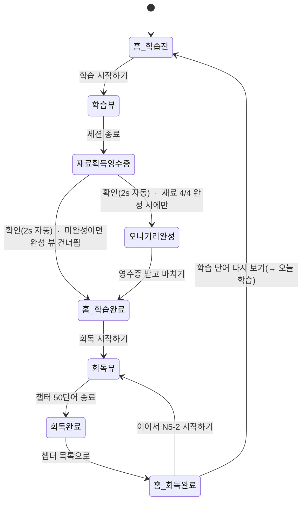

# 오니칸 리디자인 스펙 — 홈 · 학습 · 회독 · 메뉴 · 기록 · 설정 (2026-08)

> 홈의 **학습↔회독 세그먼트 토글을 제거**하고, 홈을 **상태 기반 단일 CTA** 흐름으로 재편한 리디자인.
> 학습 뷰·보상 모션·회독 플로우·기록 화면에 변경이 있으며, **디자인 시스템에도 변경 사항이 있음**(맨 아래 표 참조).

---

## ✅ 최종본 (개발 핸드오프) — 2026-08

**확정 화면 20종 = [`final-screens/`](./final-screens)** (Figma 직접 익스포트). 개발자는 이 폴더 + 아래 표 + 갱신된 `../../DESIGN.md`·`../../COMPONENTS.md`를 기준으로 구현한다.

| # | 화면 | 파일 | Figma 섹션 |
|---|---|---|---|
| 1 | 홈 · 학습 전 | `01-home-study-before.png` | 학습 `299-60470` |
| 2 | 학습 세션 · 앞면(리콜) | `02-study-front.png` | 학습 |
| 3 | 학습 세션 · 뒷면(공개, 발음유사·예문) | `03-study-reveal.png` | 학습 |
| 4 | 학습 세션 · 단어 상세(11c, 음독 브리지) | `04-study-word-detail.png` | 학습 |
| 5 | 학습 완료 결과 · 재료 영수증(확인 자동 fill) | `05-study-result.png` | 학습 |
| 6 | 주먹밥 완성 · 폭죽(조건부) | `06-onigiri-complete.png` | 학습 |
| 7 | 영수증 받기(저장/공유) | `07-receipt.png` | 학습 |
| 8 | 홈 · 학습 후 복습 완료 | `08-home-review-done.png` | 학습 |
| 9 | 홈 · 학습 후 복습 없음 | `09-home-no-review.png` | 학습 |
| 10 | 홈 · 모든 학습 완료(완료감) | `10-home-all-done.png` | 학습 |
| 11 | 회독 홈(Chapter Hub) | `11-review-hub.png` | 회독 `254-6477` |
| 12 | 회독 홈 · 필터 | `12-review-hub-filter.png` | 회독 |
| 13 | 메뉴 · 목록(도감) | `13-menu-list.png` | 메뉴 `299-69110` |
| 14 | 메뉴 · 그리드 | `14-menu-grid.png` | 메뉴 |
| 15 | 레시피 상세(재료 체크리스트) | `15-recipe-detail.png` | 메뉴 |
| 16 | 기록(점수 분포 히스토그램) | `16-stats.png` | 기록 `299-69111` |
| 17 | 설정(메인) | `17-settings.png` | 설정 `299-69393` |
| 18 | 설정 · 학습 설정 | `18-settings-learning.png` | 설정 |
| 19 | 설정 · 발음 설정 | `19-settings-pronun.png` | 설정 |
| 20 | 설정 · 데이터 백업 | `20-settings-backup.png` | 설정 |

### ⚠️ 디자인 시스템 핵심 변경 — 색 역할 재정의 (D-3, 정본 반영됨)

최종 화면 20종을 실측한 결과, **주요 액션 색이 오렌지 → 잉크로 바뀌었다.** 오렌지는 이제 CTA가 아니라 **브랜드 강조·상태**에만 쓰인다. `DESIGN.md`·`COMPONENTS.md`에 반영 완료.

| 역할 | 색 | 쓰이는 곳 (실측) |
|---|---|---|
| **주요 액션(Primary)** | **`ink #1D1D21`** 채움 + 라벨 `on-ink #F7F7F9` | 학습 시작하기 · 회독하기 · 외웠어요 · 지금 연습하기 · 오늘 학습 시작 · 영수증 받고 마치기 · 확인 · 이어서 · 레벨 칩 선택 |
| **보조/약한 액션** | **white 아웃라인** (1.5px `pressed`) | 백업 내보내기 · (완료 상태)회독하러 가기 · 아직이에요 · 발음 듣기·사전 |
| **브랜드 강조·상태** | **`primary #EF5112`**(오렌지) | 활성 탭 · **단골 도장(오렌지 오니기리)** · 섹션 오버라인(오늘 학습 완료·이어서 회독해요) · 상태 뱃지(진행 중) · 히스토그램 "나" 막대(D-2) · 음독 브리지 필 |
| **진척·완료** | **`secondary #A3E635`/green** | N5 전체 **아크 게이지**(라임→그린) · 오늘 복습 완료 카드(연녹 배경+그린 체크) · 재료 획득 체크 · 완성 뱃지 |
| **바탕/카드** | `softer #F2F2F4`(쿨 그레이) / `canvas #FFF` | 페이지 배경은 **쿨 Onikan Grey**(웜 베이지 아님) |

> 즉 **"화면당 오렌지 하나 = 주요 액션"(구 규칙)은 폐기.** 새 규칙: **주요 액션 = 잉크**, 오렌지 = 브랜드/상태 악센트, 라임/그린 = 진척·완료. 상세는 아래 §디자인 시스템 변경(Δ) 및 정본 참조.

## 출처 / 이 문서의 근거

| 자료 | 내용 |
|---|---|
| Figma `오니기리 칸지` node `254-6477` (섹션 "ui 최신화") | 원본 리디자인 파일. **직접 열람·대조 완료**(2× PNG 12종 익스포트 → `screens/`, 실제 변수·컴포넌트 이름 대조 → 아래 §실측 토큰·§신규 컴포넌트). |
| 화면 PNG ①~⑥ | 홈(학습전) · 학습 뷰 · 홈(학습완료) · 홈(회독전) · 회독 뷰+완료 · 홈(회독완료)+기록 |
| `motion/mov1` (8.25s) | 재료 획득 영수증 — `확인` 버튼 2초 fill 후 자동 전환 |
| `motion/mov2` (12.9s) | 오니기리 완성 — 폭죽 파티클 축하 뷰 |

이 문서는 **레이아웃·상태·인터랙션 명세**다. 토큰 정본은 `../../DESIGN.md`, 컴포넌트 계약은 `../../COMPONENTS.md`가 이긴다.

---

## 핵심 변경 요약

1. **홈 세그먼트 토글 제거.** `오늘 학습 | 회독` 세그먼트가 사라지고, 홈은 **하루의 상태(학습전→학습완료→회독전→회독완료)에 따라 히어로 카드와 단일 버튼이 스스로 바뀌는** 상태 머신이 됨. → `SegmentedControl(홈)` **폐기**.
2. **단골(streak) 시스템.** 연속 학습 일수에 따라 "단골 N일차" 스탬프(라임 밥알)를 지급, 혜택은 "다음 학습 재료 2배". 7일차에 `P` 배지.
3. **학습 뷰 — 음독 유사 단어 · 예문 TTS.** 발음이 비슷한 단어가 있을 때만 힌트 카드로 노출(뉴트럴, D-1). 예문 카드 탭 시 TTS 재생.
4. **보상 모션 2종.** ① 영수증 `확인` 버튼 2초 자동 fill 전환, ② 오니기리 완성 시 폭죽 파티클(재료만 획득하고 끝나면 미노출).
5. **회독 플로우 1급화.** 빈출 단어 챕터(N5-1, N5-2 …), 잠김/열기/완료 상태, `모름 | 안다` 평가. 홈 최상단 "오늘 학습 복습" 카드는 **"아직이예요"로 표시한 단어만** 모아 보는 회독.
6. **기록 화면 리디자인.** 테스트 점수 · 단골 주간 캘린더 · 4지표 그리드 · "내 학습 점수 분포" 히스토그램 · `지금 연습하기`.

## 화면 흐름

---

## ① 홈 — 오늘 학습 (학습전) · PNG①

**변경:** 세그먼트 토글 제거, 히어로 카드 중심 재배치.

- **헤더:** `8월 7일 목요일` / `오니기리 가게` (H1) + 우측 레벨 셀렉터 `N5 ▾`.
- **히어로 카드(elevated):**
  - 마스코트(사장) + 인사 카피 `왔네. 오늘은 참치마요야.`
  - 메타: `오늘 단어 20개 · 약 6분`
  - 점선 구분선 아래 **모은 재료 2/5** — 재료 칩 4개(밥·참치 = 획득 / 마요네즈·김 = `?` 잠김). ※ `Chip.next`(soft) 사용, 잠김은 `mute`.
  - **PrimaryButton `학습 시작하기 ›`** (화면당 유일 orange 대신 **ink 채움** 사용 중 — 색 정책은 DS 표 참조).
- **단골 카드(flat):** `단골 5일차` + 라임 밥알 스탬프 5 + 미획득 2(점선, 7일차 `P` 배지) / 캡션 `단골 혜택 다음 학습 재료 2배`.
  - **신규 컴포넌트 `StreakStamps`.** 스탬프 = 라임(획득) / 점선 회색(미획득) / 마지막 칸 = **단골 보호권(스트릭 프리즈)** 배지, **방패/보호 아이콘**(구 `P`, O-4 확정).
- **8월 N5 메뉴판 카드(flat):** `기초 단어 320개 중 60% 완료` + `あ` 타일. **2depth = 월별 단어 세트 상세(도감형 열람, O-2 확정)** — 진행률 + 단어 리스트(필터) + 단어 상세(11c) 재사용. 우선순위 **P2**(카드는 최소 단어 리스트로 이동).

## ② 학습 뷰 — 음독 유사 단어 · 예문 TTS · PNG②

- **상단:** `✕` 닫기 + 진행바(`1/10`) — 상단 진행바는 **연속 1자 바**.
- **카드(elevated):** 표제어 `勉強` (대형) / 읽기 `べんきょう` + TTS `IconButton` / 뜻 `공부, 학습`.
- **발음이 유사한 단어 카드 — 조건부:** `발음이 유사한 단어` 필 + `しんど │ 진도` 2열. **음독이 실제로 유사한 카드에만 노출**(항상 노출 아님).
  - **신규 컴포넌트 `PhoneticHintCard`.** ✅ **뉴트럴 처리(D-1 확정):** 원안의 라임 배경 대신 `soft` 배경 + `ink`/`body` 텍스트. 라임은 보상 전용 유지.
- **예문 카드:** `🔊 예문을 들어보세요`(스피커·라벨 **뉴트럴 `body`** — 라임 아님, D-1) + 일문/국문. **카드 탭 → 예문 TTS 재생.** `단어 상세 ›` 링크(11c).
- **하단 평가:** `아직이에요`(outline→Again) / `외웠어요`(ink→Good) = `GradeButtons`.

## ③ 재료 획득 영수증 — 버튼 자동 fill 전환 · motion/mov1

- **화면:** `오늘의 학습 · 다 했어요` / 새 재료 `참치`(라임 체크) / `참치마요 4/4` 진행 + `모든 재료를 모았어요` / `새로 배운 단어 12` · `아직이라고 표시한 단어 3` / `오늘 외운 12개는 내일 다시 확인해요.`
- **인터랙션:** 하단 `확인` 버튼이 **좌→우로 약 2초간 채워진 뒤(진행 fill) 자동으로 다음 페이지로 전환.** **탭 시 즉시 전환**(남은 fill 스킵→100% 스냅+햅틱, O-5 확정). `reduced-motion` 시 자동 비활성·일반 탭 버튼.
  - **신규 모션 `buttonAutoFill`** — 2s 선형 fill, 완료 시 자동 push. 버튼은 orange가 아닌 **ink fill / 회색 트랙**.
- **분기:** 재료 4/4 **완성 시** → ④ 오니기리 완성. **미완성**이면 ④를 건너뛰고 곧장 ⑤ 홈(학습완료).

## ④ 오니기리 완성 — 폭죽 파티클 · motion/mov2 (조건부)

- **노출 조건:** 이번 세션으로 **마지막 재료가 채워져 오니기리가 완성된 경우에만.** 재료만 획득하고 끝나면 **이 페이지는 보이지 않음.**
- **화면:** `새 주먹밥을 만들었어요.` / 중앙 오니기리 일러스트 + `완성` 배지(핑크) / `참치마요 오니기리` / 지표 `20 학습 단어 · 6분 학습 시간 · 5일 단골 기록` / 사장 대사 `참치마요는 내 최애야. — 사장님` / CTA `영수증 받고 마치기`.
- **모션:** 오니기리 뒤에서 **폭죽 파티클 버스트**(오렌지·옐로·핑크·레드 조각) → 위로 튄 뒤 중력으로 낙하·소멸(약 2~2.5s).
  - **신규 모션 `confettiBurst`.** 파티클 색은 브랜드 오렌지/라임 계열로 정리 권장(현재 다색). 완성 순간 = 보상 정점 → 라임/오렌지 사용 정당.

## ⑤ 홈 — 학습 완료 · PNG③

- **히어로 카드:** overline `오늘 학습 완료`(orange) / 카피 `틀려도 괜찮아. 그게 실력의 재료야.` / `총 10번 학습했어요` / 지표 3칸 그리드 `20 학습 단어 · 6분 학습 시간 · 5일 단골 기록` / **PrimaryButton `회독 시작하기 ›`** / 서브링크 `학습 단어 다시 보기`.
- **최근 획득 카드(flat):** 오니기리 썸네일 + `최근 획득 / 참치마요 오니기리`.
- 이하 단골·메뉴판 카드 동일.
- **버튼 라벨 전환:** 같은 히어로의 CTA가 상태에 따라 `학습 시작하기`→`회독 시작하기`로 바뀜(토글 대체의 핵심).

## ⑥ 홈 — 회독 전 (+ 오늘 학습 복습 카드) · PNG④

- **최상단 `오늘 학습 복습` 카드:** `아직이예요 단어 외우기` + `열기`(ink) 버튼. **= 오늘 학습에서 "아직이예요"로 표시한 단어만** 모아 보는 회독(FSRS 복습).
  - **신규 컴포넌트 `ReviewTopCard`.**
- **히어로(회독 전):** overline `회독 전` / 카피 `너무 잘하려고 하지 마. 꾸준히가 제일 맛있어.` / `총 10번 학습했어요` / **진행바(연속) + `진행율 0%`** / **PrimaryButton `N5 - 1 시작하기`**.
- **빈출 단어 리스트:** `50 단어씩 모두 외울 때까지 반복해요` + 챕터 행 `N5-1 (0/50) 열기` / `N5-2 잠김` …
  - **신규 컴포넌트 `ChapterRow`** — 상태 `열기(ink)` / `잠김(mute)` / `완료`. 좌측 번호 배지.
- ✅ 용어(O-3 확정): **3모드 분리** — `학습`(신규) / `복습`(오늘 "아직이에요" 단어만·FSRS, = 이 카드) / `회독`(빈출 챕터 정주행). 이름 혼용 금지, 각 진입점에 범위 부제.

## ⑦ 회독 뷰 + 회독 완료 (정보 UI 추가) · PNG⑤

- **회독 뷰:** 상단 `✕` + **연속 진행바 `8/50`** / 표제어 `対応` / 읽기 `たいおう` / 뜻 `대응` / `단어 상세 · 한자 보기 ↗` / 하단 평가 **`모름 | 안다`**(학습의 `아직이에요/외웠어요`와 다른 쌍).
  - ⚠️ `GradeButtons`는 현재 **학습 전용(아직이에요/외웠어요)** → 회독용 `모름/안다` **변형 추가** 필요(DS 표 C-1).
- **회독 완료 뷰:** 마스코트(쟁반 든 사장) / `N1-1 완료` / `50 단어 모두 외웠어요` / **지표 3칸 `20·6분·5일`(신규 정보 UI)** / CTA `챕터 목록으로` + 서브 `다시 외우기`.

## ⑧ 홈 — 회독 완료 · PNG⑥

- **히어로(회독 완료):** overline `회독 완료`(orange) / 카피 `후식까지 알차게 먹었네.` / **진행바 100%** / `진행율 100%` / **PrimaryButton `이어서 N5 - 2 시작하기 ›`** + 서브 `학습 단어 다시 보기`.
- **빈출 단어:** `N5-1 완료` / `N5-2 열기(ink)` / `N5-2 잠김` …
- **버튼 동작:**
  - `이어서 N5-2 시작하기` → 다음 회독 챕터.
  - `학습 단어 다시 보기` → **오늘 학습으로 복귀**.
  - ✅ **회독 재진입(O-1 확정):** 상설·이어보기 트랙. `이어서 N5-x`(학습완료 후 승격) + `빈출 단어` 리스트(항상). 완료→다음 챕터 언락, 완료 챕터 `다시 외우기` 재방문, 진행률 영구 저장.

## ⑨ 기록 — 그래픽 수정 · PNG⑥

- **헤더:** `8월 7일 목요일` / `기록`(H1).
- **테스트 점수 카드(flat):** `12/12` + `테스트 점수 2026.08.20` + 상승 그래프 아이콘.
- **단골 카드:** `📅 단골 6일차` + 주간(월~일) 라임 밥알 스탬프(획득/미획득 점선, 일요일 `P`) + `단골 혜택 다음 학습 재료 2배`.
- **4지표 그리드(2×2):** `읽은 단어 55 · 복습 55 · 다시 본 것 55 · 학습 55` (각 아이콘: あ / 반복 / 시계 / 학사모).
- **내 학습 점수 분포(신규 데이터 뷰):** `지난 학습 기록의 33%보다 높아요` + **히스토그램**(막대 다수, "**나**" 위치 = orange 강조, 축 `0% · 평균 97% · 100%`).
  - **신규 컴포넌트 `ScoreDistribution`(히스토그램).** orange = 사용자 위치 강조(탭바 외 orange 예외 → DS 표 D-2 확인).
- **CTA `지금 연습하기`** → **오늘 학습의 다음 챕터 화면으로 이동.**

---

## 디자인 시스템 변경 (Δ)

> 정본(`DESIGN.md`/`COMPONENTS.md`)은 **아직 수정하지 않음.** 아래는 반영 대상 델타 — 확정 후 두 문서에 반영.

### 폐기 / 변경

| ID | 항목 | 변경 |
|---|---|---|
| R-1 | `SegmentedControl(홈 오늘학습↔회독)` | **폐기.** 홈은 상태 기반 단일 CTA로 대체. COMPONENTS.md §SegmentedControl에서 "홈" 용례 삭제. |
| R-2 | 홈 화면(`10a`) | 세그먼트+진행카드 → **상태 머신 히어로**(학습전/학습완료/회독전/회독완료). handoff 5화면 #1 갱신. |

### 신규 컴포넌트 (COMPONENTS.md 카탈로그 추가 대상)

> **Figma 실측** = Figma 파일에서 확인된 실제 레이어/컴포넌트 이름. 가칭은 스펙 서술용.

| ID | 가칭 | Figma 실측 | 용도 |
|---|---|---|---|
| N-1 | `StreakStamps` | **`도장`** (컴포넌트, 4× 인스턴스) | 단골 스탬프(라임 밥알/점선 미획득/`P`) |
| N-2 | `PhoneticHintCard` | `hero`/카드 내 프레임(전용 컴포넌트 아님) | 발음 유사 단어 카드 — **뉴트럴 `--soft #e8e8ec`**(라임 아님, D-1 실측 확인) |
| N-3 | `ExampleTTSCard` | 카드 내 프레임 | 예문 카드(탭→TTS) |
| N-4 | `ChapterRow` | **`progress-card`** 내 행 | 회독 빈출단어 행(열기/잠김/완료) |
| N-5 | `ReviewTopCard` | 프레임 | 홈 "오늘 학습 복습"(아직이예요 단어) |
| N-6 | `ScoreDistribution` | 기록 내 커스텀 프레임 | 점수 분포 히스토그램 |
| N-7 | `HomeStateHero` | **`hero-card`** (+ `hero-number` 지표행, `┗ Main/Sub/Alternative Action` CTA 슬롯) | 상태별 히어로 카드(카피·지표·CTA 라벨 가변) |

**기존 컴포넌트 실측 이름 매핑:** PrimaryButton → **`button-primary`** · 지표 타일 → **`Ratio`** · 배지(완성·`P`) → **`Badge`** · 영수증 상/하단 엣지 → **`Top Acc`/`Bottom Acc`** · 진행바 → **`progress`**.

### 신규 모션 (DESIGN.md motion + handoff `interactions/MOTION.md`)

| ID | 모션 | 스펙 | 레퍼런스 |
|---|---|---|---|
| M-1 | `buttonAutoFill` | 영수증 `확인` 2s 선형 fill → 자동 push. ink fill/회색 트랙. | [mp4](./motion/button-autofill.mp4) · [gif](./motion/button-autofill.gif) |
| M-2 | `confettiBurst` | 오니기리 완성 시 파티클 버스트(≈2–2.5s). 색 브랜드 정리 권장. | [mp4](./motion/confetti-burst.mp4) · [gif](./motion/confetti-burst.gif) |

> 구현 참고: 레퍼런스는 **재현용 시각 자료**. 실제 구현은 네이티브 권장 — `buttonAutoFill`은 Reanimated width 트랜지션 + 완료 콜백 push, `confettiBurst`는 파티클/Lottie. mp4가 gif보다 가볍고 선명(개발 적용 유리), gif는 GitHub 인라인 미리보기용.

### 규칙 결정 (확정)

| ID | 사안 | 결정 |
|---|---|---|
| **D-1** ✅ | 라임을 학습 보조에 사용 | **뉴트럴로 변경.** `PhoneticHintCard`·예문 `🔊`는 라임 대신 `soft`+`ink`/`body`. **라임은 보상 전용 유지** → DESIGN.md 규칙 불변(강화). |
| **D-2** ✅ | orange 탭바 외 사용(히스토그램 "나") | **데이터 강조 예외로 명문화.** 차트의 자기 위치 1개소 한정 orange 허용. COMPONENTS.md 글로벌 규칙에 예외 1줄 추가. |
| **C-1** ✅ | 회독 평가 쌍 `모름/안다` | `GradeButtons`에 **`variant="review"`(모름/안다)** 추가. 학습 variant(아직이에요/외웠어요)와 병존. |
| 단골=보상 | (충돌 아님) | DESIGN.md L359가 이미 "a streak kept"를 보상에 포함 → `StreakStamps` 라임은 **규칙 내**. 그대로 진행. |

> ✅ **정본 반영 완료(2026-08):** `DESIGN.md`·`COMPONENTS.md`에 **D-3 색 역할 재정의(주요 액션 오렌지→잉크, 단골 도장 라임→오렌지, 라임/그린=진척·완료, 오렌지=브랜드·상태)** + `ArcGauge`·`CompletionCard`·`StatusBadge` 신규 · D-2 차트 강조 예외 · R-1(홈 세그먼트 폐기) · C-1(GradeButtons `review`) · D-1 · 신규 컴포넌트(`hero-card`·`도장`·`ChapterRow`·`ReviewTopCard`·`ScoreDistribution` 등) · T-1/T-2 편차 · 명명 매핑 · **정책 O-1~O-6** 반영 완료. 최종 화면 = [`final-screens/`](./final-screens) 20종.

## 실측 토큰·타이포 (Figma 변수 대조)

> `get_variable_defs`로 `학습전`·`학습 카드`·`기록` 프레임에서 실제 바인딩된 변수를 추출. **결론: 리디자인은 기존 `DESIGN.md` 토큰을 충실히 사용** — 색·간격·반경·그림자 정본과 일치.

**색 (모두 정본과 일치):** `--ink #1d1d21` · `--body #56565e` · `--mute #8e8e97` · `--bar-fill #71717a` · `--pressed #dcdce2` · `--soft #e8e8ec` · `--softer #f2f2f4` · `--plate #ededf1` · `--canvas #ffffff` · `--primary #ef5112` · `--on-ink #f7f7f9`.
**간격/반경/그림자:** `--spacing-xl 20` · `--spacing-md 12` · `--radius-card 24` · `Elevation/Level 1` = drop-shadow `(0,6) blur14 spread0 #0000000d`.
**타이포 (Pretendard JP):** `display/word 44/53 Bold` · `display/meaning 26/34 Bold` · `card-title 17/24 SB` · `body/lg 18/26 M` · `body/md 16/24 R` · `body/md-strong 16/22 SB` · `body/base-strong 15/22 SB` · `body/sm 14/20 R` · `tab-label(-active) 12/16`.

### 정본 반영 시 확인할 실측 편차 (2건)

| ID | 실측 | 이슈 | 제안 |
|---|---|---|---|
| **T-1** | `Semantic/Label/Alternative #37383C` (+ `#37383c9c` 알파) | 정본 그레이 램프(ink `#1D1D21` / body `#56565E`)에 **없는 중간 그레이**(기록 화면 라벨). | 정본 alias로 편입할지, 기존 `body`로 통일할지 결정. |
| **T-2** | `Caption 2/Medium` = family **`Pretendard`** (11px, ls 3.1) | 오버라인/영수증 캡션이 `Pretendard JP`가 아닌 **`Pretendard`** 사용 — 폰트 패밀리 혼용. | 전 텍스트 `Pretendard JP`로 통일(정본 규칙). |

## 정책 결정 (확정)

> 2026-08 확정. 업계 표준 + 타겟(30–40대 직장인) 멘탈 모델 기준.

| ID | 항목 | 결정 |
|---|---|---|
| **O-1** ✅ | 회독 재진입 | 회독 = 일일 루프와 **독립된 상설·이어보기 트랙**. 진입 2개: 히어로 `이어서 N5-x`(오늘 학습 완료 후에만 승격) + `빈출 단어` 리스트(항상). N5-x 완료 → N5-(x+1) 언락, 완료 챕터는 `다시 외우기`로 재방문. 진행률 영구 저장. 다음 날 홈은 `학습전`으로, 회독 진행은 유지. |
| **O-2** ✅ | 메뉴판 2depth | **월별 단어 세트 상세 = 도감형 열람 화면**. 진행률 + 단어 리스트(학습완료/미학습/틀림 필터) + 각 단어 → 단어 상세(11c) 재사용. **새 학습 루프 신설 X**. 우선순위 **P2**(카드는 최소 단어 리스트로 이동). |
| **O-3** ✅ | 복습/회독 네이밍 | **3모드 분리** — `학습`(신규·FSRS) / `복습`(오늘 "아직이에요" 단어만·FSRS) / `회독`(빈출 챕터 정주행). 이름을 섞지 않고 각 진입점에 범위 부제("틀린 단어만" vs "빈출 단어 처음부터"). |
| **O-4** ✅ | 단골 배지 | **단골 보호권(스트릭 프리즈)** — 7일 마일스톤에 1개, 하루 결석해도 단골 유지. 상시 혜택(재료 2배)과 별개. **`P` → 방패/보호 아이콘으로 교체**(Premium/Point 오독 방지). |
| **O-5** ✅ | 영수증 확인 | **탭 = 즉시 전환**(남은 fill 스킵 → 100% 스냅 + 햅틱 후 push). 자동 fill은 수동 유저용 폴백. `prefers-reduced-motion` 시 자동 fill·자동 전환 비활성(일반 탭 버튼). 요약은 `영수증 다시 보기`로 재열람 보장. |
| **O-6** ✅ | 복습 ↔ 회독 챕터 진도 연동 | **분리(B).** `복습`(오늘 "아직이에요" 단어·FSRS) 완료는 `회독` 챕터 진도(N5-x·50단어)를 **올리지 않는다**. 챕터 진도 = **coverage(새로 학습한 단어 수)** — `mastery` 아님. 챕터 진도는 **새 단어 학습(N5-x 챕터 진행)으로만 증가**. 근거: 복습 단어는 이미 학습·카운트된 단어라 합산 시 **중복 카운트·진도 부풀림**(유저가 "챕터 거의 다 함" 착각). 복습 완료는 `✓ 오늘 복습 끝`으로만 표시. |

### O-6 조건 → 결과

| 조건 | 챕터 진도(N5-1 32/50) | 표시 |
|---|---|---|
| `학습`(신규)에서 N5-1 새 단어 학습 | **증가**(+새 단어 수) | `진행 중` → `완료`(50/50) |
| `복습`(오늘 틀린 단어) 완료 | **불변** (32/50 유지) | 복습 카드만 `✓ 오늘 복습 끝` |
| `복습` 재실행(다시 복습하기) | **불변** | — (중복 카운트 없음) |

## 자료

- **[`prototypes/review-hub.html`](./prototypes/review-hub.html)** — **회독 Chapter Hub 리디자인**(단독 시안). 3단 정보구조를 **서로 다른 시각언어**로: N5 전체 진척도=**Ring 게이지**(20%), 현재 챕터=**Linear 바**(32/50·18개 남음), 챕터 리스트=**텍스트+뱃지**(진행바 없음). `챕터 1/2/3` 용어, 누적 `10회` 기록. **상태 A/B/C/D**(진행중·완료직후 해금·다음챕터·N5완료) 우하단 FAB로 전환. `이어서 회독하기` → 세션 → **회독 페이지로 복귀(오늘 홈 자동이동 X)** + 다음 챕터 자동 해금(시작은 사용자 선택). 실행: 위 서버 → `…/prototypes/review-hub.html`.
- **[`prototypes/today-review.html`](./prototypes/today-review.html)** — **인터랙티브 프로토타입**(실제 HTML 화면). 오늘 홈을 **Adaptive "다음 학습" 카드** 중심으로 재편: 흩어진 카드(회독·오늘 배운 단어·오늘 복습)를 하나로 묶고, 오늘 배운 단어는 Hero의 secondary CTA로 흡수. **홈 상태 A/B/C/D**를 우하단 미리보기 FAB로 전환:
  - **A** 복습 미완료 → 오늘 복습 Primary(오렌지) + N5 회독 Secondary(진행바+텍스트링크)
  - **B** 복습 완료 → `✓ 오늘 복습 완료` + 회독 이어가기 Primary로 승격
  - **C** 복습 대상 0 → 회독 Primary(빈 카드 없음)
  - **D** 복습·회독 모두 완료 → `오늘 공부 끝!` 완료감(오렌지 CTA 제거, 텍스트링크만)
  - 흐름: 복습하기 → 세션 → B로 전환 → 회독 이어가기 → 회독 챕터(hub) → 회독하기 → 세션 → D. **O-6 확인: 복습은 N5-1 32/50 불변, 회독 세션은 +13(→45/50)**.
  - **로컬 실행: `cd handoff && python3 -m http.server 8799` → `http://localhost:8799/redesign-2026-08/prototypes/today-review.html`** (마스코트·폰트가 상위 폴더라 file:// 직접 열기보다 서버 권장).
- **[`prototypes/flow.html`](./prototypes/flow.html)** — 탭 가능한 **흐름 플레이어**(익스포트 화면 PNG + 전환 hotspot/버튼). 전체 화면 흐름 검토용. 회독 학습 카드 등 **누락 지점은 빨간 플레이스홀더**로 표시.
- **[`screens/`](./screens)** — Figma "ui 최신화"(`254-6477`)에서 **2× PNG 12종 익스포트 완료**(학습→회독 흐름 순, 파일명·node 매핑은 [screens/README](./screens/README.md)). 영수증 수정·라임→뉴트럴(03) 반영 확인.
- **[`motion/`](./motion)** — `buttonAutoFill`·`confettiBurst` 레퍼런스(각 mp4+gif) 커밋 완료.
